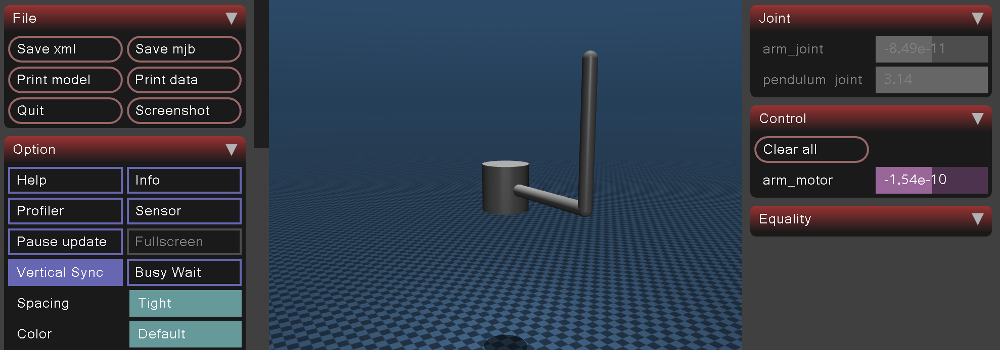

# Rotary Inverted Pendulum



A MuJoCo simulation of a rotary inverted pendulum (Furuta pendulum): a motorized arm rotates in the horizontal plane and carries a free-swinging pendulum at its tip. The goal is to swing the pendulum up from a hanging position and balance it upright.

The MJCF model is generated from a [Jinja2](https://jinja.palletsprojects.com/) template (`model.xml`), parameterized in Python, so geometry and physical constants live in one place.

## Controllers

Four control laws are implemented and selectable at runtime:

| Name           | Strategy                                                                 |
|----------------|---------------------------------------------------------------------------|
| `swingup`      | Energy-based swing-up: injects/removes energy until the pendulum reaches the energy of the upright position (default) |
| `lqr`          | State-feedback balance controller (arm + pendulum, angle + velocity), linearized about the upright equilibrium via MuJoCo finite differences |
| `hybrid`       | Energy-based swing-up until the pendulum is near the top (within 20°), then switches to the LQR balance controller |
| `proportional` | Naive proportional feedback on the pendulum angle alone — kept as a pedagogical baseline; without damping or arm feedback it never truly settles (compare against `hybrid`) |

`hybrid` is the full swing-up-and-balance demo. `lqr` alone is useful for testing the balance controller in isolation, e.g. with `--initial-angle near-up`.

## Installation

Dependencies are managed with [uv](https://docs.astral.sh/uv/). Install uv, then:

```bash
uv sync
```

This creates a `.venv` and installs the exact dependency versions pinned in `uv.lock`.

## Usage

```bash
uv run python sim.py --controller hybrid --initial-angle down    # full swing-up + balance (default)
uv run python sim.py --controller lqr --initial-angle near-up    # balance controller alone
uv run python sim.py --controller hybrid --plot energy            # live-plot a quantity while it runs
uv run python sim.py --controller hybrid -v                       # print angle/velocity/torque each step
uv run python sim.py --help
```

`--initial-angle` selects the pendulum's starting position: `down` (hanging, the classic swing-up case), `up` (exactly at the unstable equilibrium), `near-up` (3° off the top), or `side` (horizontal).

`--plot {energy,angle,torque}` opens a live matplotlib window tracking that quantity over a rolling 10-second window. It runs in a separate OS process — on macOS, `mjpython` reserves the simulation process's main thread for the MuJoCo viewer, and matplotlib's native backend requires a window to be created on its own process's main thread, so the plot can't share the simulation's process.

> **macOS:** the interactive viewer (`mujoco.viewer.launch_passive`) must run on the main thread of the OS's main application, which the regular `python` interpreter doesn't set up. Use `mjpython` instead of `python` — it ships with the `mujoco` package (installed at `.venv/bin/mjpython` by `uv sync`):
> ```bash
> uv run mjpython sim.py --controller hybrid --initial-angle down
> ```
> Otherwise the script fails with `RuntimeError: launch_passive requires that the Python script be run under mjpython on macOS`. All the `uv run python sim.py ...` examples above need `mjpython` in place of `python` on macOS.

A MuJoCo viewer window opens and the simulation runs in real time. Close the window to stop.

## Project structure

```
.
├── sim.py       # simulation entry point: model build, controllers, real-time loop
├── model.xml    # Jinja2-templated MJCF model (parameterized geometry)
├── scene.xml    # static MJCF scene (ground, lighting, etc.), included by model.xml
├── docs/        # background reading on rotary inverted pendulum dynamics and control
├── pyproject.toml
└── uv.lock      # pinned dependency versions, keep in sync with pyproject.toml
```

`model_rendered.xml` is generated at each run (the fully-substituted MJCF, for inspection) and is not meant to be edited or committed.

## Background

The `docs/` folder contains reference material on the dynamics and control of rotary inverted pendulums (energy-based swing-up, LQR balancing) used while developing the controllers in this repo.
